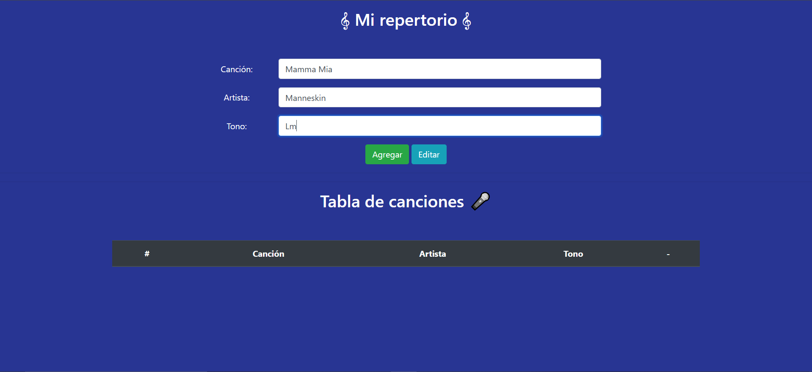
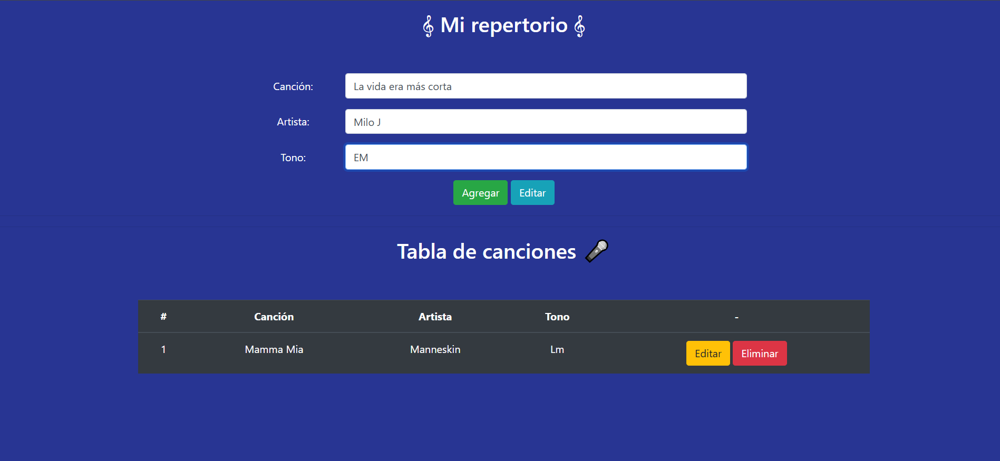
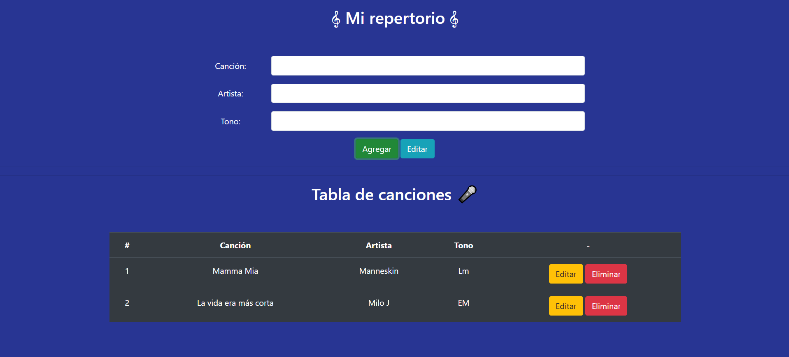
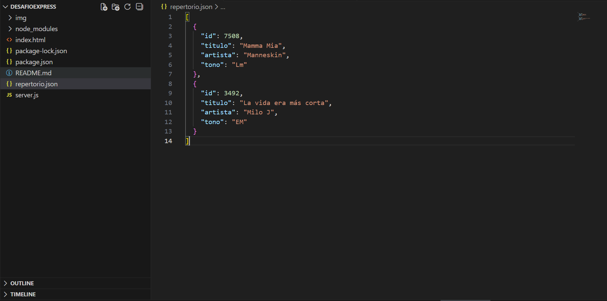
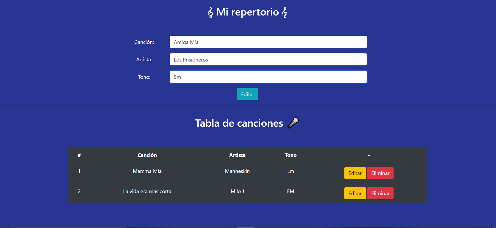
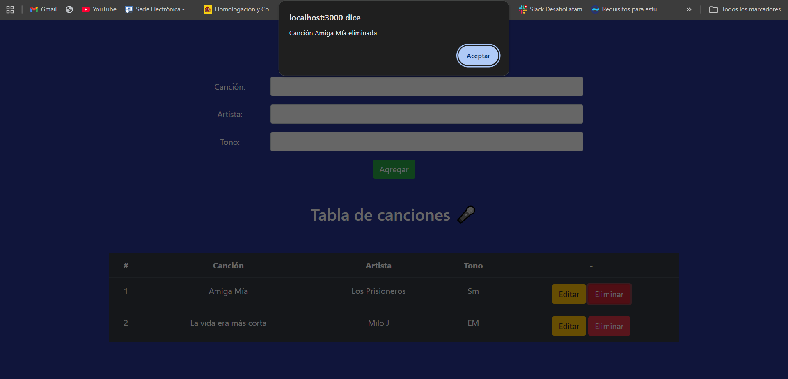
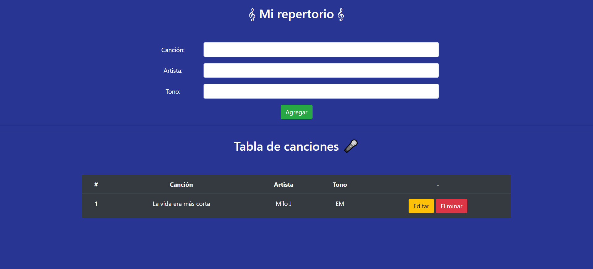

# Desafío Mi Repertorio

Aplicación desarrollada con Node.js y Express que permite administrar un repertorio musical mediante operaciones CRUD (Crear, Leer, Actualizar y Eliminar).

## Tecnologías utilizadas

- Node.js
- Express
- File System (fs)
- HTML
- JavaScript
- Axios

## Estructura del proyecto

```plaintext
desafioExpress/
│
├── img/
│ ├── inicio.png
│ ├── agregar1.png
│ ├── agregar2.png
│ ├── editar1.png
│ ├── editar2.png
│ ├── editar3.png
│ ├── eliminar1.png
│ ├── eliminar2.png
│ └── repertorio.png
├── index.html
├── repertorio.json
├── server.js
├── package.json
├── package-lock.json
└── node_modules/
```

## Instalación

1. Clonar el repositorio

```bash
git clone https://github.com/Konscio/desafio-express-repertorio.git
```

2. Ingresar al directorio

```bash
cd mi-repertorio
```

3. Instalar dependencias

```bash
npm install
```

4. Ejecutar el proyecto

```bash
npm run dev
```

o

```bash
nodemon server.js
```

## Funcionalidades

### Obtener canciones

```http
GET /canciones
```

Obtiene el listado completo de canciones almacenadas.

### Agregar una canción

```http
POST /canciones
```

Ejemplo de cuerpo de la solicitud:

```json
{
  "id": 1,
  "titulo": "A Dios le Pido",
  "artista": "Juanes",
  "tono": "Dm"
}
```

### Actualizar una canción

```http
PUT /canciones/:id
```

Permite modificar una canción existente.

### Eliminar una canción

```http
DELETE /canciones/:id
```

Permite eliminar una canción según su identificador.

## Ejemplos de ejecución

### Vista principal



### Agregar canción





### Repertorio actualizado



### Editar canción





### Eliminar canción





## Autor

Sebastián Cabrera
